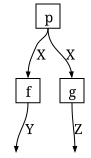

# Markov categories as a GATlab theory
Simon Frost

- [Overview](#overview)
- [What is a Markov category?](#what-is-a-markov-category)
- [Setup](#setup)
- [Free expressions](#free-expressions)
- [FinStoch as a model](#finstoch-as-a-model)
- [Evaluating expressions](#evaluating-expressions)
- [The Markov axiom in FinStoch](#the-markov-axiom-in-finstoch)
- [Summary](#summary)
- [References](#references)

## Overview

`MarkovCategories.jl` states the operations on finite stochastic kernels
of `FiniteKernels.jl` (whose “Finite stochastic kernels” vignette
introduces them) as a GATlab *theory*, so that Catlab’s symbolic
expressions, wiring diagrams and `@instance` mechanism apply to
conditional probability tables ([Patterson et al.
2022](#ref-PattersonLynchFairbanks2022)). This vignette shows the theory
hierarchy, builds free (symbolic) string-diagram expressions, evaluates
them in **FinStoch**, and checks the Markov axiom numerically.

## What is a Markov category?

A **Markov category** ([Fritz 2020](#ref-Fritz2020)), whose copy-discard
fragment is the CD category of ([Cho and Jacobs
2019](#ref-ChoJacobs2019)), is a symmetric monoidal category
$(\mathcal{C}, \otimes, I)$ in which every object $X$ carries a
commutative comonoid

$$\Delta_X : X \to X \otimes X, \qquad !_X : X \to I,$$

compatible with the tensor product, and such that discarding is natural:
$f \cdot !_Y = !_X$ for every morphism $f : X \to Y$. Morphisms are
thought of as stochastic maps; $\Delta$ copies a value and $!$ forgets
it. Copying is deliberately *not* required to be natural, because for a
stochastic $f$, “sample once and copy” ($f \cdot \Delta_Y$) differs from
“sample twice” ($\Delta_X \cdot (f \otimes f)$). A symmetric monoidal
category in which both $\Delta$ and $!$ are natural is *cartesian* –
this is Fox’s theorem ([Fox 1976](#ref-Fox1976)) – and there every
morphism is deterministic. The same axioms are stated in Lean in
Mathlib’s `CopyDiscardCategory` and `MarkovCategory` ([The mathlib
Community 2020](#ref-Mathlib2020)), which the `proofs/` development of
`FiniteKernels.jl` follows.

`MarkovCategories.jl` expresses this hierarchy with GATlab theories,
reusing Catlab’s monoidal-category theories so that Catlab’s expression
and wiring-diagram tooling applies unchanged:

| theory | adds |
|----|----|
| `ThSymmetricMonoidalCategory` (Catlab) | `otimes`, `munit`, `braid` |
| `ThCopyDiscardCategory` = `ThMonoidalCategoryWithDiagonals` (Catlab) | `mcopy`, `delete` and the comonoid and coherence axioms |
| `ThMarkovCategory` (this package) | naturality of `delete` |
| `ThCartesianCategory` (Catlab) | naturality of `mcopy` as well |

## Setup

``` julia
using MarkovCategories
using Catlab
```

``` julia
ThMarkovCategory
```

    MarkovCategories.ThMarkovCategory

The theory carries all the axioms of its parents; the last one is the
Markov axiom. (Source-location comments are dropped from the printout.)

``` julia
for line in split(sprint(show, ThMarkovCategory.Meta.theory), '\n')
    occursin("#=", line) || println(line)
end
```

    GAT(ThMarkovCategory):
      Ob::TYPE ⊣ []
      Hom(dom, codom)::TYPE ⊣ [dom::Ob, codom::Ob]
      compose(f, g)::Hom(a, c) ⊣ [a::Ob, b::Ob, c::Ob, f::Hom(a, b), g::Hom(b, c)]
      (assoc := compose(compose(f, g), h) == compose(f, compose(g, h))) ⊣ [a::Ob, b::Ob, c::Ob, d::Ob, f::Hom(a, b), g::Hom(b, c), h::Hom(c, d)]
      id(a)::Hom(a, a) ⊣ [a::Ob]
      (idl := compose(id(a), f) == f) ⊣ [a::Ob, b::Ob, f::Hom(a, b)]
      (idr := compose(f, id(b)) == f) ⊣ [a::Ob, b::Ob, f::Hom(a, b)]
      otimes(A, B)::Ob ⊣ [A::Ob, B::Ob]
      otimes(f, g)::Hom(otimes(A, C), otimes(B, D)) ⊣ [A::Ob, B::Ob, C::Ob, D::Ob, f::Hom(A, B), g::Hom(C, D)]
      munit()::Ob ⊣ []
      (otimes(otimes(A, B), C) == otimes(A, otimes(B, C))) ⊣ [A::Ob, B::Ob, C::Ob]
      (otimes(munit(), A) == A) ⊣ [A::Ob]
      (otimes(A, munit()) == A) ⊣ [A::Ob]
      (otimes(otimes(f, g), h) == otimes(f, otimes(g, h))) ⊣ [A::Ob, B::Ob, C::Ob, X::Ob, Y::Ob, Z::Ob, f::Hom(A, X), g::Hom(B, Y), h::Hom(C, Z)]
      (otimes(id(munit()), f) == f) ⊣ [A::Ob, B::Ob, f::Hom(A, B)]
      (otimes(f, id(munit())) == f) ⊣ [A::Ob, B::Ob, f::Hom(A, B)]
      (compose(otimes(f, g), otimes(h, k)) == otimes(compose(f, h), compose(g, k))) ⊣ [A::Ob, B::Ob, C::Ob, X::Ob, Y::Ob, Z::Ob, f::Hom(A, B), h::Hom(B, C), g::Hom(X, Y), k::Hom(Y, Z)]
      (id(otimes(A, B)) == otimes(id(A), id(B))) ⊣ [A::Ob, B::Ob]
      braid(A, B)::Hom(otimes(A, B), otimes(B, A)) ⊣ [A::Ob, B::Ob]
      (compose(braid(A, B), braid(B, A)) == id(otimes(A, B))) ⊣ [A::Ob, B::Ob]
      (braid(A, otimes(B, C)) == compose(otimes(braid(A, B), id(C)), otimes(id(B), braid(A, C)))) ⊣ [A::Ob, B::Ob, C::Ob]
      (braid(otimes(A, B), C) == compose(otimes(id(A), braid(B, C)), otimes(braid(A, C), id(B)))) ⊣ [A::Ob, B::Ob, C::Ob]
      (braid(A, munit()) == id(A)) ⊣ [A::Ob]
      (braid(munit(), A) == id(A)) ⊣ [A::Ob]
      (compose(otimes(f, g), braid(B, D)) == compose(braid(A, C), otimes(g, f))) ⊣ [A::Ob, B::Ob, C::Ob, D::Ob, f::Hom(A, B), g::Hom(C, D)]
      mcopy(A)::Hom(A, otimes(A, A)) ⊣ [A::Ob]
      delete(A)::Hom(A, munit()) ⊣ [A::Ob]
      (compose(mcopy(A), otimes(mcopy(A), id(A))) == compose(mcopy(A), otimes(id(A), mcopy(A)))) ⊣ [A::Ob]
      (compose(mcopy(A), otimes(delete(A), id(A))) == id(A)) ⊣ [A::Ob]
      (compose(mcopy(A), otimes(id(A), delete(A))) == id(A)) ⊣ [A::Ob]
      (compose(mcopy(A), braid(A, A)) == mcopy(A)) ⊣ [A::Ob]
      (mcopy(otimes(A, B)) == compose(otimes(mcopy(A), mcopy(B)), otimes(otimes(id(A), braid(A, B)), id(B)))) ⊣ [A::Ob, B::Ob]
      (delete(otimes(A, B)) == otimes(delete(A), delete(B))) ⊣ [A::Ob, B::Ob]
      (mcopy(munit()) == id(munit())) ⊣ []
      (delete(munit()) == id(munit())) ⊣ []
      (compose(f, delete(B)) == delete(A)) ⊣ [A::Ob, B::Ob, f::Hom(A, B)]

## Free expressions

`FreeMarkovCategory` is the symbolic model of `ThMarkovCategory`, built
with Catlab’s `@symbolic_model` in the same way as
`FreeSymmetricMonoidalCategory`. Objects and generating morphisms are
declared by name, and the operations build expressions with composition
and tensor normalised to be strictly associative and unital.

``` julia
X, Y, Z = Ob(FreeMarkovCategory, :X, :Y, :Z)
f = Hom(:f, X, Y)
g = Hom(:g, X, Z)
p = Hom(:p, munit(FreeMarkovCategory.Ob), X)
```

    p: I → X

A fan-out, in which one value of `X` feeds both `f` and `g`:

``` julia
fanout = compose(mcopy(X), otimes(f, g))
```

    mcopy{X}⋅(f⊗g): X → Y⊗Z

``` julia
dom(fanout), codom(fanout)
```

    (X, otimes(Y,Z))

Expressions have Unicode and LaTeX renderings:

``` julia
show_unicode(fanout)
```

    mcopy{X}⋅(f⊗g)

``` julia
show_latex(fanout)
```

    \Delta_{X} \cdot \left(f \otimes g\right)

Catlab can turn an expression into a wiring diagram (copies are drawn as
a wire fanning out and deletions as a wire ending), and lay it out as
TikZ or Graphviz:

``` julia
wd = to_wiring_diagram(compose(p, fanout))
nboxes(wd), nwires(wd)
```

    (3, 4)

``` julia
using Catlab.Graphics
using Logging: NullLogger, with_logger
# Catlab warns that the optional Convex/SCS port layout is unavailable; the
# fixed layout is fine here.
tikz = with_logger(NullLogger()) do
    to_tikz(compose(p, fanout); labels=true)
end
lines = split(sprint(Catlab.Graphics.TikZ.pprint, tikz), '\n')
println(join(lines[1:min(end, 12)], '\n'), "\n...")
```

    \usepackage{amssymb}
    \usetikzlibrary{calc}
    \usetikzlibrary{shapes.geometric}
    \usetikzlibrary{decorations.markings}
    \begin{tikzpicture}[unit length/.code={{\newdimen\tikzunit}\setlength{\tikzunit}{#1}},unit length=4mm,x=\tikzunit,y=\tikzunit,semithick,box/.style={rectangle,draw,solid,rounded corners},junction/.style={circle,draw,fill,inner sep=0},outer box/.style={draw=none},wire/.style={draw,postaction={decorate},decoration={markings,mark=at position 0.5 with {#1}}}]
      \node[outer box,minimum width=12.5\tikzunit,minimum height=7\tikzunit] (root) at (0,0) {};
      \node[box,minimum size=2\tikzunit] (n1) at (-3.25,0) {$p$};
      \node[junction,minimum size=0.5\tikzunit] (n2) at (0,0) {};
      \node[box,minimum size=2\tikzunit] (n3) at (3.25,1.5) {$f$};
      \node[box,minimum size=2\tikzunit] (n4) at (3.25,-1.5) {$g$};
      \path[wire] (n2.-30) to[out=-30,in=-180] (n4.west);
      \path[wire] (n2.30) to[out=30,in=-180] (n3.west);
    ...

The preceding block shows generated TikZ source. This cell renders the
Graphviz drawing itself, rather than printing the graph object’s type:

``` julia
to_graphviz(wd; labels=true)
```



## FinStoch as a model

The finite stochastic category is registered with
`@instance ThMarkovCategory{FiniteSpace, FiniteKernel}`, so every
operation in the theory hierarchy dispatches on spaces and kernels,
including the operator aliases:

``` julia
SX = FiniteSpace(:X, [:x0, :x1])
SY = FiniteSpace(:Y, [:y0, :y1, :y2])
SZ = FiniteSpace(:Z, [:z0, :z1])
k = cpt(factors(SX)[1], factors(SY)[1], [0.7 0.2 0.1; 0.1 0.3 0.6])
h = deterministic(SX, SZ, x -> x == :x0 ? :z0 : :z1)
Δ(SX) ⋅ (k ⊗ h) == compose(mcopy(SX), otimes(k, h))
```

    true

## Evaluating expressions

`evaluate(expr, generators)` interprets a free expression in FinStoch by
the structure-preserving functor determined by the images of the
generators (Catlab’s `functor` with the FinStoch instance supplying
every non-generator node). Generators may be keyed by name or by
expression.

``` julia
prior = state(SX, [0.3, 0.7])
gens = Dict(:X => SX, :Y => SY, :Z => SZ, :f => k, :g => h, :p => prior)
evaluate(compose(p, fanout), gens)
```

    FiniteKernel{Float64}(I → Y{y0,y1,y2} ⊗ Z{z0,z1})
               ()
      y0,z0  0.21
      y1,z0  0.06
      y2,z0  0.03
      y0,z1  0.07
      y1,z1  0.21
      y2,z1  0.42

The result is exactly the direct computation:

``` julia
evaluate(compose(p, fanout), gens) ≈ compose(prior, mcopy(SX), otimes(k, h))
```

    true

A chain $X \to Y \to Z$ written as an expression and as a matrix
product:

``` julia
l = cpt(factors(SY)[1], factors(SZ)[1], [0.9 0.1; 0.5 0.5; 0.2 0.8])
chain = compose(Hom(:k, X, Y), Hom(:l, Y, Z))
direct = compose(k, l)
evaluate(chain, Dict(:X => SX, :Y => SY, :Z => SZ, :k => k, :l => l)) ≈ direct,
kernel_matrix(direct) ≈ kernel_matrix(l) * kernel_matrix(k)
```

    (true, true)

Generators without an image raise a typed error:

``` julia
try
    evaluate(chain, Dict(:X => SX, :Y => SY, :Z => SZ, :k => k))
catch err
    showerror(stdout, err)
end
```

    UnboundGeneratorError: no kernel or space bound to generator :l

## The Markov axiom in FinStoch

Because the instance is a model of `ThMarkovCategory`, the axioms hold
numerically. Naturality of discard holds for every kernel built by the
public constructors, since they are normalised:

``` julia
evaluate(compose(f, delete(Y)), gens) ≈ evaluate(delete(X), gens)
```

    true

Naturality of copy, the extra cartesian axiom, holds for the
deterministic `h` but not for the stochastic `k`:

``` julia
copy_natural(m) = compose(m, mcopy(codom(m))) ≈ compose(mcopy(dom(m)), otimes(m, m))
copy_natural(h), copy_natural(k)
```

    (true, false)

This is the formal content of “copy once is not two samples” from the
`FiniteKernels.jl` vignette, and the reason Bayesian-network semantics
must live in a Markov category rather than a cartesian one.

## Summary

`ThMarkovCategory` is Catlab’s `ThMonoidalCategoryWithDiagonals` plus
the single axiom that discarding is natural; `FreeMarkovCategory` builds
string-diagram expressions over that theory, and the FinStoch
`@instance` makes the same operations run on conditional probability
tables, so `evaluate` is an honest functor from expressions to kernels.
Naturality of copy, the extra axiom that would make the category
cartesian, holds only for deterministic kernels, which is why
Bayesian-network semantics need a Markov category.
`CategoricalBayesianNetworks.jl` compiles the ACSet structures supplied
by `BayesianNetworks.jl` into these expressions. The ordinary model and
inference packages remain independent of Catlab and this categorical
adapter.

## References

<div id="refs" class="references csl-bib-body hanging-indent">

<div id="ref-ChoJacobs2019" class="csl-entry">

Cho, Kenta, and Bart Jacobs. 2019. “Disintegration and Bayesian
Inversion via String Diagrams.” *Mathematical Structures in Computer
Science* 29 (7): 938–71. <https://doi.org/10.1017/S0960129518000488>.

</div>

<div id="ref-Fox1976" class="csl-entry">

Fox, Thomas. 1976. “Coalgebras and Cartesian Categories.”
*Communications in Algebra* 4 (7): 665–67.
<https://doi.org/10.1080/00927877608822127>.

</div>

<div id="ref-Fritz2020" class="csl-entry">

Fritz, Tobias. 2020. “A Synthetic Approach to Markov Kernels,
Conditional Independence and Theorems on Sufficient Statistics.”
*Advances in Mathematics* 370: 107239.
<https://doi.org/10.1016/j.aim.2020.107239>.

</div>

<div id="ref-PattersonLynchFairbanks2022" class="csl-entry">

Patterson, Evan, Owen Lynch, and James Fairbanks. 2022. “Categorical
Data Structures for Technical Computing.” *Compositionality* 4 (5).
<https://doi.org/10.32408/compositionality-4-5>.

</div>

<div id="ref-Mathlib2020" class="csl-entry">

The mathlib Community. 2020. “The Lean Mathematical Library.”
*Proceedings of the 9th ACM SIGPLAN International Conference on
Certified Programs and Proofs (CPP 2020)*, 367–81.
<https://doi.org/10.1145/3372885.3373824>.

</div>

</div>
